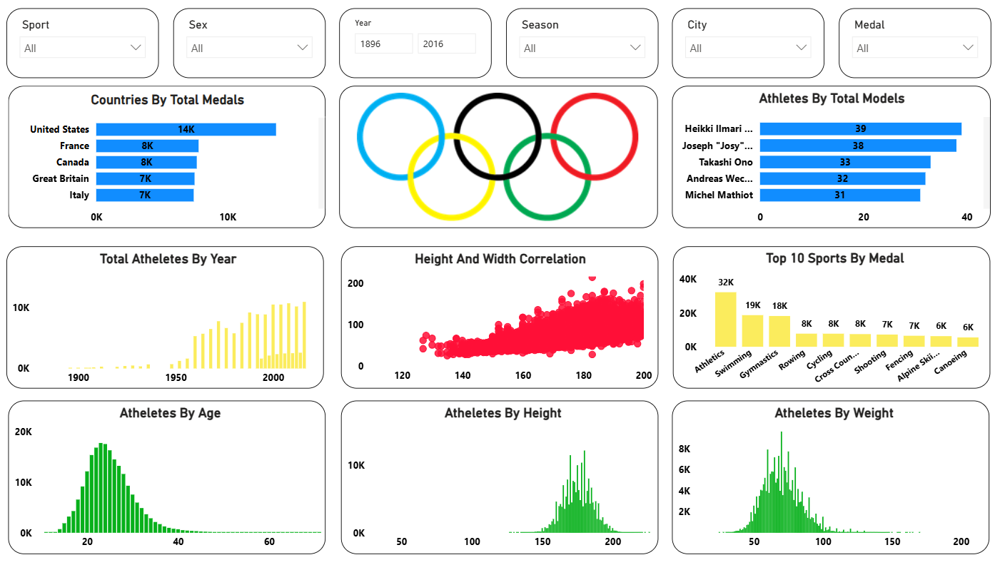

# 🏅 120 Years of Olympics Dashboard (Power BI)

📌 Dashboard Preview

This project is a **Power BI dashboard** built using the **Kaggle “120 Years of Olympic History” dataset (271K+ rows)**.  
Each row represents **one athlete in one event**, which makes the analysis extremely detailed and perfect for real-world practice in cleaning, modeling, and interactive reporting.

## 🧩 Context
Olympic data is massive: athletes, events, sports, cities, seasons, medals, and changing participation across decades.  
The challenge is turning that historical dataset into a dashboard that answers questions quickly like:
- Which countries win the most medals?
- Which athletes have the most medals?
- How has participation changed over time?
- Which sports dominate medal counts?
- What does athlete profile distribution look like (age, height, weight)?
- Are height and weight correlated across athletes?

## 🎯 Objective
Build an interactive dashboard that enables users to explore Olympic history across:
- **Medals** (country, athlete, sport)
- **Participation trends** (athletes over time)
- **Athlete demographics** (age, height, weight)
- **Filters** for slicing the analysis by sport, gender, year range, season, city, and medal type

## ✅ What I Built
A single-page interactive dashboard with:

### Filters / Slicers
- Sport  
- Sex  
- Year (range)  
- Season  
- City  
- Medal  

### Key Visuals
- **Countries by Total Medals** (Top countries)
- **Athletes by Total Medals** (Top medal-winning athletes)
- **Top 10 Sports by Medals**
- **Total Athletes by Year** (participation trend over time)
- **Height vs Weight Correlation** (scatter plot)

## 🔧 How I Did It
1. Loaded the Kaggle Olympics dataset into **Power BI**
2. Cleaned and shaped the data using **Power Query**
   - Handled missing values  
   - Standardized data types (year, medal, numeric columns)  
   - Prepared fields for visuals and filtering  
3. Created **DAX measures** for:
   - Medal counts (total medals / medal-type breakdown)
   - Total athletes and participation trends
   - Top-N ranking logic (countries, athletes, sports)
4. Built an interactive report experience using slicers
   - Ensured visuals cross-filter correctly across sport/sex/year/season/city/medal

## 📈 Impact / Insights Enabled
This dashboard makes it easy to:
- Identify top medal-winning **countries** and **athletes**
- Compare medal dominance across **sports**
- Explore how Olympic participation changed across **120+ years**
- Analyze athlete characteristics using distributions (age/height/weight)
- Study relationships like **height vs weight correlation**
- Drill into specific sports, years, seasons, cities, and medal types using slicers

## 🧠 Skills Used
- Power BI (dashboard design + modeling)
- Power Query (data cleaning & shaping)
- DAX (measures for medals, athletes, trends, rankings)
- Interactive slicers + cross-filtering
- Data storytelling (clean, readable visuals)
- **Athletes by Age** (distribution)
- **Athletes by Height** (distribution)
- **Athletes by Weight** (distribution)

